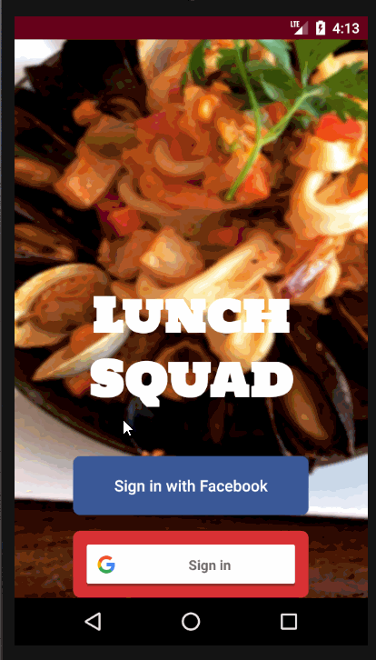

# LunchSquadApp
LunchSquad is an application used by all employees. It will allow users to find restaurants nearby and allow users to share a restaurant choice with co-workers. Users can check out where co-workers are headed for lunch and decide if they'd like to go with them. Just before the lunch break, the app will notify employees and invite them to join their co-workers. Code is Java and backend db is via Cloud Firestore.

